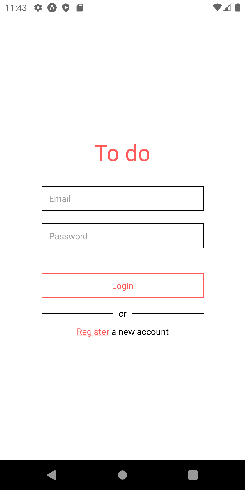
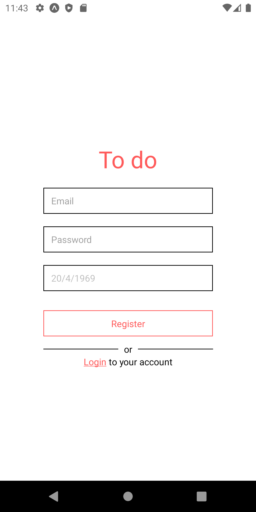
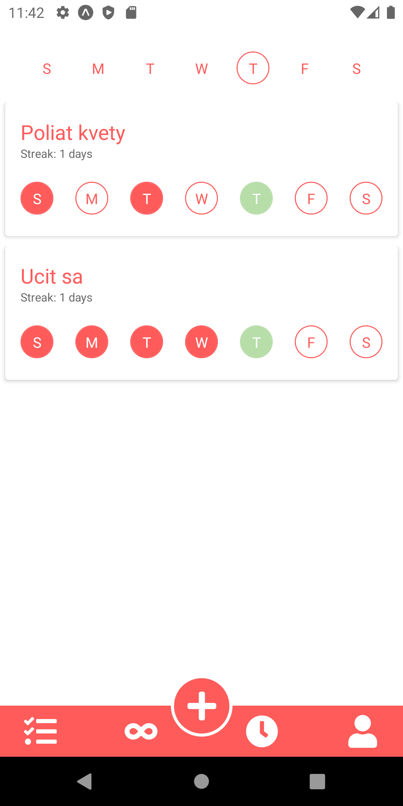
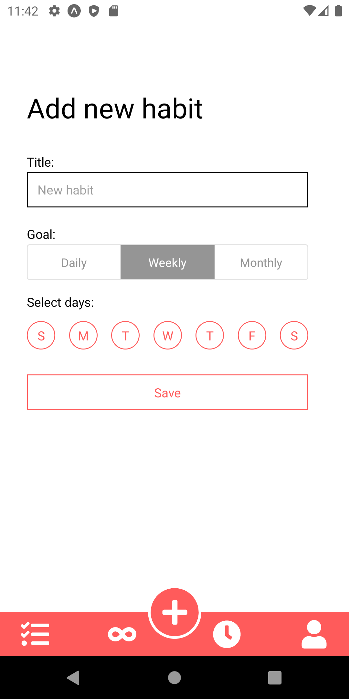
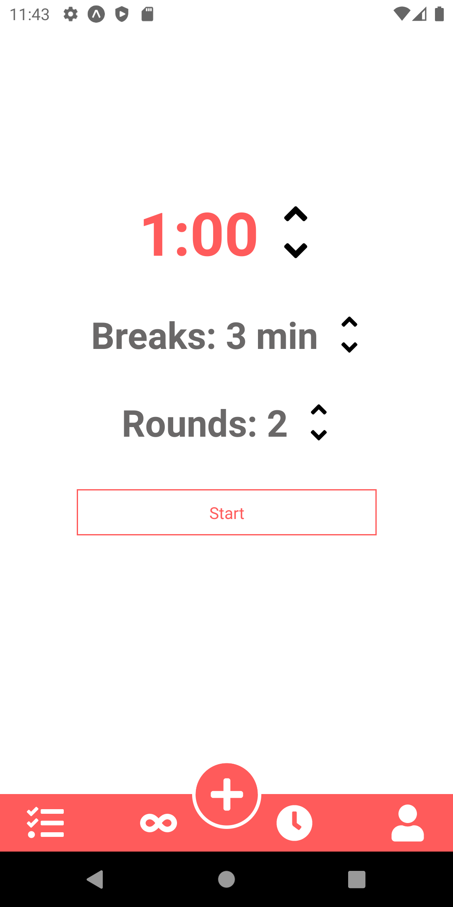
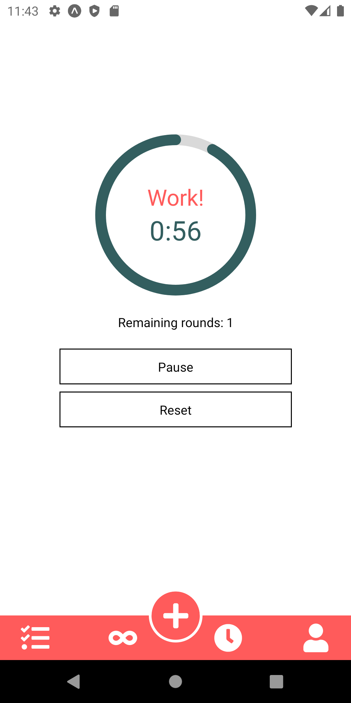
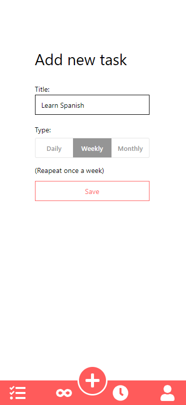
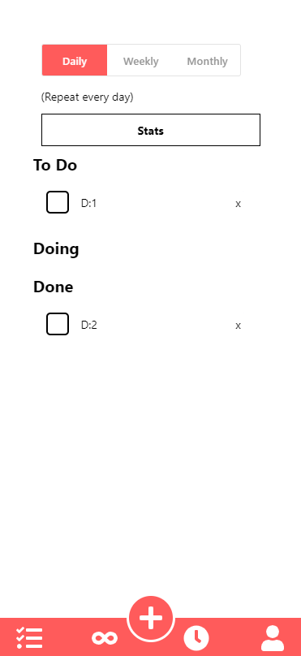
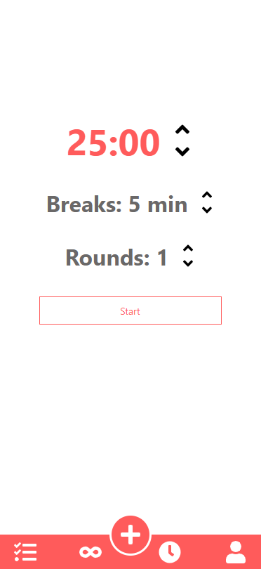
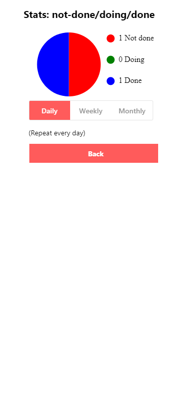

# Frontend for Productivity App

 Productivity-App sa skladá z frontendu a backendu. Aplikácia má slúžiť ako pomocník, ktorý zvýši vašu produktivitu!
 Do aoplikácie sa používateľ __registruje__ a __prihlási__. Po prihlásení bude môcť používateľ vykonávať nasledovné akcie: 
 - pridávať, mazať a pozmeňovať stav "taskov"/úloh (2 obrazovky)
 - pridávať, mazať a pozmeňovať stav "habits"/rutín (2 obrazovky)
 - pridanie fotky, pozmenenie údajov (1 obrazovka)
 - pomodoro časovač (timer, breaks, rounds) (1 obrazovka)
Aplikácia poskytuje úkony vytvorenia (e.g. "post task"), zobrazenia ("get tasks"), upravenia (zmeň stav tasku), a mazania dát (zmaž "task").
Tieto úkony sú demonštrované vo viacerích prípadoch. 

Aplikácia je vytvorená v react-native, pričom je používaný token na autentizáciu a redux + redux thunk + redux toolkit na state management.

Poznámka: Dokumentácia k backendu, je odovzdaná samostatne. Link na backend Github je v kapitole "Links". Samotná pozostáva z viacerých odovzdaní do študentského portálu AIS, preto tu nie sú vyobrazené návrhy, end pointy, a testy, hoc sú spomínané.

## Links

Github link (terajšie odovzdanie): https://github.com/mfranczel/Productivity-App-Frontend

Github Productivity App BackEnd link - backend: https://github.com/mfranczel/Productivity-App-Backend

Figma link: https://www.figma.com/file/3mQ06X0TIL0YV9JzjN36n0/MTAA?node-id=0%3A1


## Zmeny oproti návrhu
- použitie "koláčového" grafu namiesto stĺpcového grafu, viacej sa nám hodí pre prehľadnejšie zobrazenie dát
- zmena vytvorenia nového "habitu" - denný sa má robiť každý deň, týždenný počas vybraných dní a mesačný počas určitého vybraného počtu dní

### Akceptačné testy frontendu
- Test 1: Registrácia a prihlásenie používateľa - PASSED
- Test 2: Vytvorenie nového “tasku” - PASSED
- Test 3: Vytvorenie nového “habitu” - PASSED
- Test 4: Vytvorenie nového “tasku” s chýbajúcim názvom - PASSED
- Test 5: Prihlásenie neprihláseného používateľa - PASSED

Poznámka: Akceptačné testy sú rozpísané v aise, druhé odovzdanie "Franczel_Kusnir_UAT.zip", demonštrované budú na cvičení.

## Spustenie
```console
npm i
npm run start
```

```constants
zmenit IP adresu
```

## Screenshoots
Login 


Registracia


Habits


New Habit


Timer


Timer running









